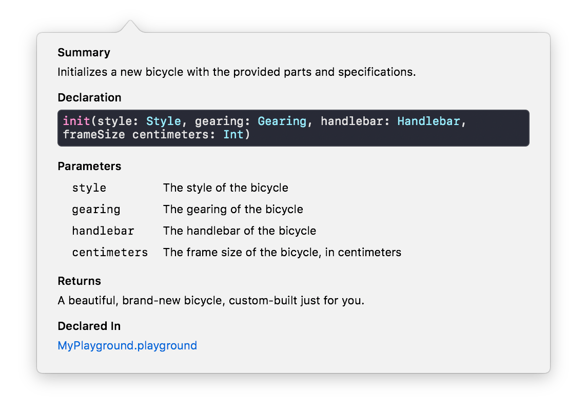

### Документирование кода

Простые комментарии в Swift начинаются с `//` или `/*`. Документирующие комментарии начинаются с `///` или `/**` для обычного кода либо `//:` или `/*:` для песочницы.

Вот как выглядит типичный док-коммент:

```swift
/// This function returns a *hello* string for a given `subject`.
///
/// - Warning: The returned string is not localized.
///
/// Usage:
///
///     println(hello("Markdown")) // Hello, Markdown!
///
/// - Parameter subject: The subject to be welcomed.
///
/// - Returns: A hello string to the `subject`.
func hello(subject: String) -> String {
    return "Hello, \(subject)!"
}
```

а вот как он отображается:


Внутри комментариев можно использовать разметку Markdown: курсив, полужирное начертание, код, нумерованные и ненумерованные списки.

* Заголовки обозначаются `#` или подчёркиванием `=====`.
* Параграфы разделяются пустыми строками. Первый параграф становится *Summary*, остальные -- *Discussion*.
* Работает \*курсивное\*, \*\*полужирное\*\* начертание и \`код\`.
* Ненумерованные списки обозначаются символами `-`, `+`, `*`.
* Нумерованные списки обозначаются `1.` или `1)`.
* Работают ссылки и картинки. Xcode умеет их отображать.

Как описываются параметры:

```swift
/// Returns the magnitude of a vector in three dimensions
/// from the given components.
///
/// - Parameters:
///     - x: The *x* component of the vector.
///     - y: The *y* component of the vector.
///     - z: The *z* component of the vector.
func magnitude3D(x: Double, y: Double, z: Double) -> Double {
    return sqrt(pow(x, 2) + pow(y, 2) + pow(z, 2))
}
```

Пример документированного класса:

```swift
/// A two-wheeled, human-powered mode of transportation.
class Bicycle {
    /// Frame and construction style.
    enum Style {
        /// A style for streets or trails.
        case road

        /// A style for long journeys.
        case touring

        /// A style for casual trips around town.
        case cruiser

        /// A style for general-purpose transportation.
        case hybrid
    }

    /// Mechanism for converting pedal power into motion.
    enum Gearing {
        /// A single, fixed gear.
        case fixed

        /// A variable-speed, disengageable gear.
        case freewheel(speeds: Int)
    }

    /// Hardware used for steering.
    enum Handlebar {
        /// A casual handlebar.
        case riser

        /// An upright handlebar.
        case café

        /// A classic handlebar.
        case drop

        /// A powerful handlebar.
        case bullhorn
    }

    /// The style of the bicycle.
    let style: Style

    /// The gearing of the bicycle.
    let gearing: Gearing

    /// The handlebar of the bicycle.
    let handlebar: Handlebar

    /// The size of the frame, in centimeters.
    let frameSize: Int

    /// The number of trips traveled by the bicycle.
    private(set) var numberOfTrips: Int

    /// The total distance traveled by the bicycle, in meters.
    private(set) var distanceTraveled: Double

    /**
     Initializes a new bicycle with the provided parts and specifications.

     - Parameters:
        - style: The style of the bicycle
        - gearing: The gearing of the bicycle
        - handlebar: The handlebar of the bicycle
        - frameSize: The frame size of the bicycle, in centimeters

     - Returns: A beautiful, brand-new bicycle,
                custom-built just for you.
     */
    init(style: Style,
         gearing: Gearing,
         handlebar: Handlebar,
         frameSize centimeters: Int)
    {
        self.style = style
        self.gearing = gearing
        self.handlebar = handlebar
        self.frameSize = centimeters

        self.numberOfTrips = 0
        self.distanceTraveled = 0
    }

    /**
     Take a bike out for a spin.

     Calling this method increments the `numberOfTrips`
     and increases `distanceTraveled` by the value of `meters`.

     - Parameter meters: The distance to travel in meters.
     - Precondition: `meters` must be greater than 0.
     */
    func travel(distance meters: Double) {
        precondition(meters > 0)
        distanceTraveled += meters
        numberOfTrips += 1
    }
}
```

Быстрая документация в Xcode для метода `travel` выглядит так:



Вот как выглядит Quick Help в актуальной версии Xcode:


Сама Xcode умеет либо рендерить картинки вроде вышеприведённой либо генерировать XML-файл из комментариев. Превратить их в красивый HTML можно с помощью [Jazzy](https://github.com/realm/jazzy). Устанавливается она легко:

```
sudo gem install jazzy
```
