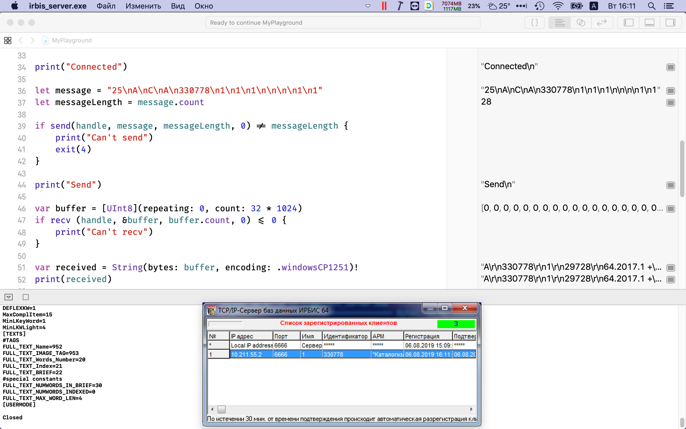

### Unsafe в Swift

Swift задумывался как язык, совместимый с Objective-C и простым C. Поэтому в нём заложена возможность работы с указателями и «сырой» (неуправляемой) памятью. Делается это совсем не так, как в C#, однако, привыкнуть можно ко всему, в том числе и к подходу Apple. :)

Простейшее выделение памяти с её освобождением:

```swift
let N = 1000 // количество элементов массива
let ptrA = UnsafeMutablePointer<Int32>.allocate(capacity: N)
defer { ptrA.deallocate() } // не забываем освобождать память
let sizeOfInt32 = MemoryLayout.size(ofValue: Int32.self)
memset(ptrA, 0, sizeOfInt32 * N)
print(ptrA) // выведет адрес массива
for index in 0..<N {
    ptrA[index] = Int32(index)
}
let ptrB = ptrA // копируется только значение указателя, а не массив!
for index in 0..<N {
    // ожидаемо напечатает числа от 0 до N
    print(ptrB[index], terminator:", ")
}
memcpy(ptrB, ptrA, sizeOfInt32 * N) // скопировать массив можно так
```

**Обратите внимание: для нетривиальных типов данных могут потребоваться вызовы `ptrA.initialize(repeating:count)` и `ptrA.deinitialize(count)`!** Если мы работаем с типами вроде `Int32` в примере выше, ничего страшного не случится, если мы не вызовем `initialize`. Однако, если мы будем иметь дело с типами, для которых копия экземпляра не создаётся простым побитовым копированием, могут возникнуть утечки памяти и падения программы.

Один и тот же «сырой» указатель можно использовать для доступа к различным типам данных. Делать это лучше так:

```swift
let rawPointer = UnsafeRawPointer(uint64Pointer)
fullInteger = rawPointer.load(as: UInt64.self)
firstByte = rawPointer.load(as: UInt8.self)
```

Работает адресная арифметика:

```swift
let numbers: [Int32] = [2, 12, 85, 0, 6]
let ptr1 = UnsafePointer<Int32>(numbers)
print(ptr1, ptr1[0], ptr1[1])
let ptr2 = ptr1 + 2
print(ptr2, ptr2[0], ptr2[1])
```

Массив может автоматически преобразовываться в указатель на его нулевой элемент. `UnsafeMutablePointer` может автоматически приводиться к `UnsafePointer`, это радует. Наоборот — нет, это тоже радует. :)

Очень важно не давать указателям вроде `ptr1` из примера выше «убегать» из контекста, в котором они созданы, т. к. по завершению контекста, они будут указывать совсем не туда, куда предполагается (массив будет разрушен по выходу из функции, ведь он больше не нужен, а указатель останется).

#### * * *

Имена типов указателей констатируются по следующей схеме:

```
Unsafe[Mutable][Raw][Buffer]Pointer
```

здесь `Mutable` означает, что вы можете изменять данные, на которые он указывает, `Raw` означает, что он не типизированный (указывает на массив байтов), `Buffer` что он может работать как коллекция.

Как работать с нетипизированным указателем:

```swift
let pointer: UnsafeMutableRawPointer = malloc(100)!
defer { free(pointer) }
 
// записываем данные
pointer.storeBytes(of: 42, as: Int.self)
pointer.advanced(by: stride).storeBytes(of: 6, as: Int.self)
 
// считываем данные
let first = pointer.load(as: Int.self)
let second = pointer.advanced(by: stride).load(as: Int.self)
```

Как превратить нетипизированный указатель в типизированный:
```swift
let typedPointer = rawPointer.bindMemory(to: Int.self, capacity: 2)
```
**Нельзя «биндить» один и тот же указатель к двум разным типам одновременно!** Нужно сначала использовать метод `withMemoryRebound` у первого типизированного указателя!


Для чего нужен указатель-коллекция:

```swift
let bufferPointer = UnsafeBufferPointer<Int>(start: typedPointer, count: 2)
for (index, value) in bufferPointer.enumerated() {
    print("value \(index): \(value)")
}
```

#### * * *

Немного о выравнивании структур в памяти:

```swift
struct SampleStruct {
    let number: UInt32
    let flag: Bool
}
 
print(MemoryLayout<SampleStruct>.size)      // 5
print(MemoryLayout<SampleStruct>.alignment) // 4
print(MemoryLayout<SampleStruct>.stride)    // 8
```

#### * * *

Как достучаться до «сырых» данных объекта (структуры)? Магию обеспечивает функция `withUnsafeBytes`:

```swift
struct SampleStruct {
    let number: UInt32
    let flag: Bool
}
 
var sample = SampleStruct(number: 25, flag: true)
withUnsafeBytes(of: &sample) {
    bytes in
    for byte in bytes {
        print(byte, terminator: ", ")
    }
}
```

Другой вариант магии обеспечивает функция `withUnsafePointer`:

```swift
struct SampleStruct {
    let number: UInt32
    let flag: Bool
}
 
var sample = SampleStruct(number: 25, flag: true)
withUnsafePointer(to: &sample) {
    $0.withMemoryRebound(to: Int16.self, capacity: 2, {
        print($0[0], $0[1])
    })
}
```

#### * * *

Вот как, например, можно общаться с сервером ИРБИС64 при помощи BSD-сокетов на Swift:

```
import Foundation
 
var handle = socket(AF_INET, SOCK_STREAM, 0)
if handle < 0 {
    print("Can't create socket!")
    exit(1)
}
defer {
    close(handle)
    print("Closed")
}
 
var host = "10.211.55.3"
var addr = sockaddr_in()
var addr2 = sockaddr()
let addrSize = MemoryLayout.size(ofValue: addr)
memset(&addr, 0, addrSize)
addr.sin_len = UInt8(addrSize)
addr.sin_family = UInt8(AF_INET)
addr.sin_port = (UInt16(6666)).bigEndian
if inet_pton(AF_INET, host, &addr.sin_addr) < 0 {
    print("Can't resolve address!")
    exit(2)
}
 
print("Connecting...")
 
memcpy(&addr2, &addr, addrSize)
if connect(handle, &addr2, UInt32(addrSize)) < 0 {
    print("Can't connect")
    exit(3)
}
 
print("Connected")
 
let message = "25\nA\nC\nA\n330778\n1\n1\n1\n\n\n\n1\n1"
let messageLength = message.count
 
if send(handle, message, messageLength, 0) != messageLength {
    print("Can't send")
    exit(4)
}
 
print("Send")
 
var buffer = [UInt8](repeating: 0, count: 32 * 1024)
if recv (handle, &buffer, buffer.count, 0) <= 0 {
    print("Can't recv")
    exit(5)
}
 
var received = String(bytes: buffer, encoding: .windowsCP1251)!
print(received)
```

